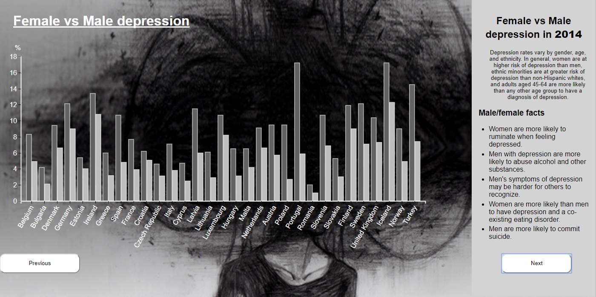

# Depression around Europe
For this design I have collect different data about depression in Europe. This prototype consists of a Europe map graph, a dual bar chart and a Force Directed Graph. Through this design you are able to get better insights about depression. You get these insights through the data given in the graphs and the text on the right side.

The idea to make a design about depression in Europe came from the [research case](https://luisa-braga-dos-santos.gitbooks.io/technologie-en-psychiatrie-research-case/content/onderzoek/onderzoek10.html) that I previously had made for the class Research for data.


### Depression in Europe:

This visualization was based on the code from [The Netherlands vacation destination in ...](https://github.com/mymphy/fe3-assessment-3) originally based on [d3.js slider map](http://bl.ocks.org/tomschulze/961d57bd1bbd2a9ef993f2e8645cb8d2) by Tom Schulze (GNU v.3).

### Female vs Male depression:

This visualization was based on the code from [Languages bar chart](https://github.com/mymphy/fe3-assessment-1) originally based on [Horizontal Bar Chart with Tooltip D3 V4](https://bl.ocks.org/alandunning/7008d0332cc28a826b37b3cf6e7bd998) by Alan Dunning (The MIT License).

### Top 5 search on depression:

This visualization was based on the code from [Force directed graph for D3.js v4 with labelled edges and arrows](http://bl.ocks.org/fancellu/2c782394602a93921faff74e594d1bb1) by Dino Fancellu (GNU v.3).

## Data
For this design I used 3 different main data`s.
### Depression in Europe:
For the Europe map graph I used data about depression in the countries of Europe. I tried to search for the data from the year 2012 to the year 2016. Unfortunately I was not able to find the data from all these years, so I used the data from 2014 to 2016.
* Data 2014: http://appsso.eurostat.ec.europa.eu/nui/show.do?dataset=hlth_ehis_cd1e&lang=en
* Data 2015: http://px.hagstofa.is/pxen/sq/4c8244b2-8d4e-4f2b-8d5f-eaa4ddb9ca68
* Data 2016: Estimated data from [Prevalence and burden of depression and anxiety disorders:
Country estimates, 2015](http://apps.who.int/iris/bitstream/10665/254610/1/WHO-MSD-MER-2017.2-eng.pdf?ua=1) rapport
```
{
"depression": {
"2014": {
"BE": 7.1,
"BG": 6.7,
"CZ": 3.9,
"DK": 8.0,
"DE": 10.6,
"EE": 4.8,
"IE": 12.1,
...
, "2015": {
"BE": 7.0,
"BG": 7.9,
"CZ": 3.2,
"DK": 6.3,
"DE": 8.5,
...
```
[depression.json](./data/depression.json)

### Female vs Male depression:
For the dual bar chart I searched for the data about female/male depression over the years 2014. 2015 and 2016. On the internet I was only able to find the data from 2014 and 2015. But for the dual bar chart itself I only used the data of the year 2014. An addition of the year 2015 is recorded in my to do list.
* Data 2014: http://appsso.eurostat.ec.europa.eu/nui/show.do?dataset=hlth_ehis_cd1e&lang=en
* Data 2015: http://px.hagstofa.is/pxen/sq/4c8244b2-8d4e-4f2b-8d5f-eaa4ddb9ca68
```
country,female,male
Belgium,8.3,4.9
Bulgaria,4.2,2.1
Denmark,9.4,6.6
Germany,12.1,9
Estonia,5.4,4
...
```
[gender.csv](./data/gender.csv)

### Top 5 search on depression:
For the Force Directed Graph I collected the data myself from [Google Trends](https://trends.google.com/trends/explore?date=2014-01-01%202016-12-31&geo=NL&q=Depression). I used the data from the period `01/01/2014 until 31/12/2016` of the top 5 `Related queries` per country from Europe that was listed in the previous used data.
<details>
 <summary> Data used:<summary>
 
 [Denmark](https://trends.google.com/trends/explore?date=2014-01-01%202016-12-31&geo=DK&q=Depression)

 [United Kingdom](https://trends.google.com/trends/explore?date=2014-01-01%202016-12-31&geo=GB&q=Depression)

 [France](https://trends.google.com/trends/explore?date=2014-01-01%202016-12-31&geo=FR&q=Depression)

 [Croatia](https://trends.google.com/trends/explore?date=2014-01-01%202016-12-31&geo=HR&q=Depression)

 [Italy](https://trends.google.com/trends/explore?date=2014-01-01%202016-12-31&geo=IT&q=Depression)

 [Cyprus](https://trends.google.com/trends/explore?date=2014-01-01%202016-12-31&geo=CY&q=Depression)

 [Latvia](https://trends.google.com/trends/explore?date=2014-01-01%202016-12-31&geo=LV&q=Depression)

 [Lithuania](https://trends.google.com/trends/explore?date=2014-01-01%202016-12-31&geo=LT&q=Depression)

 [Luxembourg](https://trends.google.com/trends/explore?date=2014-01-01%202016-12-31&geo=LU&q=Depression)

 [Hungary](https://trends.google.com/trends/explore?date=2014-01-01%202016-12-31&geo=HU&q=Depression)

 [Malta](https://trends.google.com/trends/explore?date=2014-01-01%202016-12-31&geo=MT&q=Depression)

 [Austria](https://trends.google.com/trends/explore?date=2014-01-01%202016-12-31&geo=AT&q=Depression)

 [Poland](https://trends.google.com/trends/explore?date=2014-01-01%202016-12-31&geo=PL&q=Depression)

 [Portugal](https://trends.google.com/trends/explore?date=2014-01-01%202016-12-31&geo=PT&q=Depression)

 [Romania](https://trends.google.com/trends/explore?date=2014-01-01%202016-12-31&geo=RO&q=Depression)

 [Slovenia](https://trends.google.com/trends/explore?date=2014-01-01%202016-12-31&geo=SI&q=Depression)

 [Slovakia](https://trends.google.com/trends/explore?date=2014-01-01%202016-12-31&geo=SK&q=Depression)

 [Finland](https://trends.google.com/trends/explore?date=2014-01-01%202016-12-31&geo=FI&q=Depression)

 [Sweden](https://trends.google.com/trends/explore?date=2014-01-01%202016-12-31&geo=SE&q=Depression)

 [Turkey](https://trends.google.com/trends/explore?date=2014-01-01%202016-12-31&geo=TR&q=Depression)

 [Ierland](https://trends.google.com/trends/explore?date=2014-01-01%202016-12-31&geo=IE&q=Depression)

 [Estonia](https://trends.google.com/trends/explore?date=2014-01-01%202016-12-31&geo=EE&q=Depression)

 [Czechia](https://trends.google.com/trends/explore?date=2014-01-01%202016-12-31&geo=CZ&q=Depression)

 [Bulgaria](https://trends.google.com/trends/explore?date=2014-01-01%202016-12-31&geo=BG&q=Depression)

 [Netherlands](https://trends.google.com/trends/explore?date=2014-01-01%202016-12-31&geo=NL&q=Depression)

 [Belgium](https://trends.google.com/trends/explore?date=2014-01-01%202016-12-31&geo=BE&q=Depression)

 [Germany](https://trends.google.com/trends/explore?date=2014-01-01%202016-12-31&geo=DE&q=Depression)

</details>
 
```
{
"nodes": [
{
"name": "depressie",
"label": "Netherlands",
"id": 1,
"type": "circle",
"size": 1
},
...
"links": [
{
"source": 6,
"target": 1,
"country": "",
"type": ""
},
...
```
 
[relation.json](./data/relation.json)

## Features

### Depression in Europe:
* [`d3.geoPath`](https://github.com/d3/d3-geo/blob/master/README.md#geoPath) - Creates a new geographic path generator with the default settings.
* [`d3.scaleBand`](https://github.com/d3/d3-scale/blob/master/README.md#scaleBand) - Constructs a new band scale with the empty domain, the unit range [0, 1], no padding, no rounding and center alignment.
* [`d3.scaleLinear`](https://github.com/d3/d3-scale/blob/master/README.md#scaleLinear) - Constructs a new continuous scale with the unit domain [0, 1] and the unit range [0, 1]
* [`d3.scaleQuantile`](https://github.com/d3/d3-scale/blob/master/README.md#scaleQuantile) - Quantile scales map a sampled input domain to a discrete range. Constructs a new quantile scale with an empty domain and an empty range. The quantile scale is invalid until both a domain and range are specified.
* [`topojson`](https://github.com/topojson/topojson/wiki) - TopoJSON is an extension of GeoJSON that encodes topology.
* [`d3.event`](https://github.com/d3/d3-selection/blob/master/README.md#event) - This is set during the invocation of an event listener, and is reset after the listener terminates.
* [`selection.transition`](https://github.com/d3/d3-transition/blob/master/README.md#selection_transition) - Returns a new transition on the given selection with the specified name.
* [`d3.mouse .on(click)`](https://github.com/d3/d3-selection/blob/master/README.md#mouse) - Returns the x and y coordinates of the current event relative to the specified container.
* [`d3.zoom`](https://github.com/d3/d3-zoom/blob/master/README.md#zoom) - Creates a new zoom behavior.
* [`zoom.scaleExtent`](https://github.com/d3/d3-zoom/blob/master/README.md#zoom_scaleExtent) - The scale extent restricts zooming in and out.
* [`zoomIdentity`](https://github.com/d3/d3-zoom/blob/master/README.md#zoom_transform) -
* [` d3.quantile`]() - Returns the p-quantile of the given sorted array of numbers, where p is a number in the range [0,1].
* [`selection.node`](https://github.com/d3/d3-selection/blob/master/README.md#selection_node) - Returns the first (non-null) element in this selection. If the selection is empty, returns null.
* [`selection.call`](https://github.com/d3/d3-selection/blob/master/README.md#selection_call) - Invokes the specified function exactly once, passing in this selection along with any optional arguments.
* [`d3.map`](https://github.com/d3/d3-collection/blob/master/README.md#map) - Constructs a new map. If object is specified, copies all enumerable properties from the specified object into this map. The specified object may also be an array or another map.
* [`array.push`](https://developer.mozilla.org/en-US/docs/Web/JavaScript/Reference/Global_Objects/Array/push) - Add one or more elements to the end of the array.
* [`selection/enter`](https://github.com/d3/d3-selection/blob/master/README.md#selection_enter) - Returns the enter selection: placeholder nodes for each datum that had no corresponding DOM element in the selection. (The enter selection is empty for selections not returned by selection.data.)
* [`selection.update`](https://github.com/d3/d3-selection/blob/master/README.md#selection_data) - Joins the specified array of data with the selected elements, returning a new selection that represents the update selection: the elements successfully bound to data.
* [`selection.exit`](https://github.com/d3/d3-selection/blob/master/README.md#selection_exit) - Returns the exit selection: existing DOM elements in the selection for which no new datum was found. (The exit selection is empty for selections not returned by selection.data.)
* [`selection.remove`](https://github.com/d3/d3-selection/blob/master/README.md#selection_remove) - Removes the selected elements from the document.

### Female vs Male depression:
* [`d3-scale`](https://github.com/d3/d3-scale#api-reference)
— Also known as a continuous scale because it maps a serial set of input values to output values. We can use that in a table to make the data grow to fit a specific range and domain. The range represents the values that we want to scale our data to.
— It maps a serial set of input values to output values. With a domain and a range, but also a couple of additional methods to control the spacing in between the bars. With the scale you can use the bandwidth method.
* [`d3-request`](https://github.com/d3/d3-request#api-reference)
— or loading files
* [`d3-axis`](https://github.com/d3/d3-axis#api-reference)
— Reference marks for scales
* [`d3-selection`](https://github.com/d3/d3-selection#api-reference)
— used to get a selection of elements, and data() is bound to them.
* [`d3.mouse`](https://github.com/d3/d3-selection/blob/master/README.md#selection_on)
— `mousemove`
Mousemove event triggers every time the mouse pointer is moved over the div element.
— `mouseover`
Mouseover event triggers when the mouse pointer enters the div element.
— `mouseout`
Mouseout event occurs when the mouse pointer is moved out of the div element

### Top 5 search on depression:
* [`d3-force`](https://github.com/d3/d3-force) - numerical integrator for simulating physical forces on particles
* [`selection.update`](https://github.com/d3/d3-selection/blob/master/README.md#selection_data) - Joins the specified array of data with the selected elements, returning a new selection that represents the update selection: the elements successfully bound to data.
* [`d3-drag`](https://github.com/d3/d3-drag) - Move the pointer to an object, press and hold to grab it, “drag” the object to a new location, and release to “drop”. 

## Workflow
To read about my workflow during this project go to [workflow](workflow.md)

### Changes made

##### HTML

##### CSS

Added the [`button.js`](./js/button.js) file.
#### Depression in Europe:
##### JS
* Removed unnecessary code from the original one. (like the bar chart)
* Added a `tooltip` where you can see the name of the country and how much the % depression is. The placement will depend on the mouse event on the screen.
```
 tooltipMap
    .style("left", d3.event.pageX + "px")     
    .style("top",d3.event.pageY - 100  + "px") 
    .style("display", "inline-block") 
    .html((d.properties.name) + "<br>" + (data[d.id]) + "%" );  
```
* Changed the `range` color scale 
```
 var scale = d3.scaleQuantile()
    .domain(quantiles_calc)
    .range(["#C2BCBC", "#939393", "#696969", "#3f3f3f", "#000"]);
```

#### Female vs Male depression:
##### JS
* Changed the `.range` color scale.
```
var z = d3.scaleOrdinal()
    .range(["#636363", "#bdbdbd"]);
```
* Added a `tooltip` that the placement will depend on the mouse event on the screen.
```
tooltip
    // /http://bl.ocks.org/juan-cb/ac731adaeadd3e855d26  d3.event.pageX/d3.event.pageY
        .style("left", d3.event.pageX + "px")       
        .style("top",d3.event.pageY - 50  + "px")  
        .style("display", "inline-block") 
        .html(( d.value + "%"))
```
* Rotated the label on the x-axis.

#### Top 5 search on depression:
##### JS
* Removed unnecessary code from the original one. (like the arrows)
* Added two variables to change the way a physic force works.
```
/*
https://roshansanthosh.wordpress.com/2016/09/25/forces-in-d3-js-v4/
*/
var attractForce = d3.forceManyBody().strength(80).distanceMax(350)
.distanceMin(200);
var collisionForce = d3.forceCollide(15).strength(15).iterations(100);

var simulation = d3.forceSimulation()
    .force("link", d3.forceLink().id(function (d) {return d.id;}).distance(250).strength(1))
    .force("charge", d3.forceManyBody())
    .force("center", d3.forceCenter(width / 2.5, height / 2))
    .force("attractForce",attractForce)
    .force("collisionForce",collisionForce);
```
* Added a attribute that links the radius of a circle to the data `d.size`.
```
node.append("circle")
//size depends on the size data.
    .attr("r", function(d) { return (d.size) })
    .style("fill", circleColour)
```
* Added a function that will change the color of depending on the `d.type` of teh data.
```
function circleColour(d){
    if(d.type == "circle"){
        return "white"
    }
    else {
        return "red";
    }
}
```
* Added an on `mouseenter` and `mouseleave`. It shows the text per word. And only if the word is from a specified type.
```
    .on("mouseenter", function(d){
        if(d.type == "circle"){
            extraInfo
            .append("text")
            .text( d.extra )
                
            extraInfo
            .select("ul").style("display", "none")
        } 
        else{
            return
        }
            
    })
    .on("mouseleave", function(){
        extraInfo
        .select("text")
        .remove();

        extraInfo
        .select("ul").style("display", "inline-block")
    })
```

## To do

### Depression in Europe:
* Countries that does not have data you get `undefined` by hovering. Next step would be making an if statement that checks if there is data and if there isn't it returns only the name of the country.
* Change the slider navigation to three buttons.
* Try to find the data for the countries that aren't listed in the used data but are showed in the Europe map.
* Animations.

### Female vs Male depression:
* Add the data of 2015 as well.
* Make the graph update when changing between the years.
* Make options to display the data alphabetically or from high to low.
* Animations.

### Top 5 search on depression:
* Assign a framework that the graph won't be able to go out of the framework.
* Make interactive options that allows the user to see the search word per country or per search words.
* Zoom interaction.
* Animations.

## Links used for research
* [Where is Breast Cancer?](http://www.nytimes.com/2013/10/16/health/uganda-fights-stigma-and-poverty-to-take-on-breast-cancer.html?_r=1&#g-graphic)
* [fe(3)](https://cmda-fe3.github.io/course-17-18/)
* [d3 map with states and countries](http://bl.ocks.org/MaciejKus/61e9ff1591355b00c1c1caf31e76a668)
* [d3-scale-chromatic](https://github.com/d3/d3-scale-chromatic)
* [COLORBREWER 2.0](http://colorbrewer2.org/#type=sequential&scheme=Greys&n=3)
* [Enter, Update, Exit](https://medium.com/@c_behrens/enter-update-exit-6cafc6014c36)
* [TopoJSON Collection](https://github.com/deldersveld/topojson#netherlands)
* [Rotated Axis Labels](https://bl.ocks.org/mbostock/4403522)
* [Grouped Bar Chart with Legend and Tooltips](http://bl.ocks.org/juan-cb/ac731adaeadd3e855d26)
* [Force-Directed Graph with Drag/Zoom/Pan/Center/Resize/Labels/Shapes/Filter/Highlight](http://bl.ocks.org/eyaler/10586116)
* [Force directed graph for D3.js v4 with labelled edges and arrows](http://bl.ocks.org/fancellu/2c782394602a93921faff74e594d1bb1)
* [Zoomable Force Directed Graph d3v4](https://bl.ocks.org/puzzler10/4438752bb93f45dc5ad5214efaa12e4a)
* [Bounded Force Layout](https://bl.ocks.org/mbostock/1129492)
* [d3-force testing ground](https://bl.ocks.org/steveharoz/8c3e2524079a8c440df60c1ab72b5d03)

## License
[GNU v.3](https://opensource.org/licenses/GPL-3.0) © Luisa Braga dos Santos
